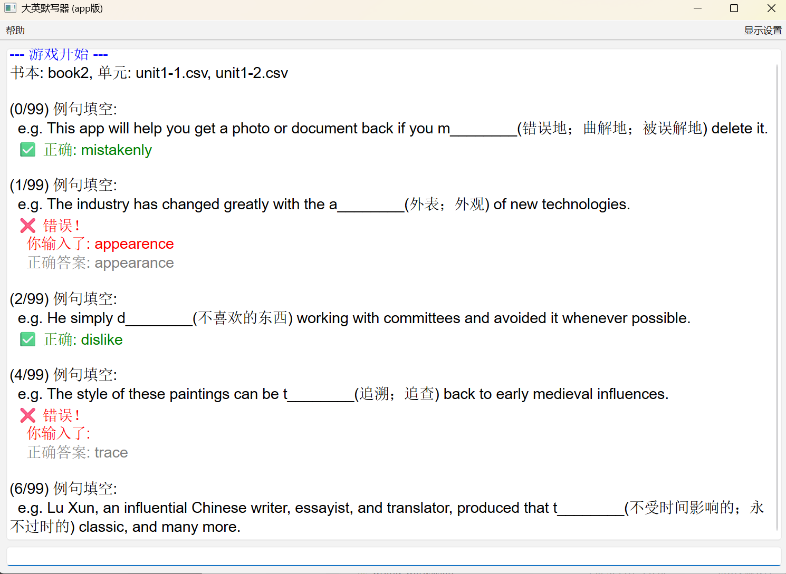

# ZJU大英默写器(app版)

一个功能强大、高度可定制的 PyQt6 单词和短语背诵工具。

## 简介

本项目是一个参照本人原有项目和e志大英默写器(https://eng.zjueva.net/) 的优化版项目，同时已内置了大英三和大英四的所有词书，方便ZJU学子复习

## 功能特性

* **分离式架构**: UI (`main.py`)、游戏逻辑 (`engine.py`) 和数据加载 (`model.py`) 完全解耦。
* **高度灵活的模式**: 自由组合四种学习设置：
    * **内容**: 全部 / 仅单词 / 仅短语
    * **顺序**: 顺序模式 / 随机模式
    * **模式**: 单词模式 (中->英) / 例句模式 (填空)
    * **提示**: 可选“显示首字母”
* **智能例句填空**: 支持 `[[...]]` 标记的例句挖空，并能自动处理单词变形。
* **自动错题本**: 自动记录答错的单词；复习时自动移除已答对的词。
* **数据持久化**: 错题本自动保存为 `wrong_words.json`，实现跨次使用。
* **可定制指令系统**:
    * 通过 `keybindings.json` 文件自由映射快捷键 (如 `a` -> "跳过")。
    * 内置 `/clear` (清屏), `/clc` (清空错题本), `/review` (复习) 等高级指令。
* **现代 UI**:
    * 使用 PyQt6 构建，包含可折叠的固定设置面板。
    * “滚动日志”式的主界面，可随时查看历史记录。
    * 内置“帮助/关于”面板。

## 界面截图



## 快速开始 (用户)

本项目无需安装。下载 `release.zip` 压缩包并解压后，保持以下文件结构不变：
大英默写器/
├── data/                    
│   ├── book2/
│   │   ├── unit1-1.csv
│   │   └── ...
│   └── book3/
│       └── ...
│
│
└── main.exe

双击 `main.exe` 即可启动程序。

## 自定义 (高级用户)

你可以直接编辑以下文件来自定义你的体验，无需重新编译：

1.  **词库 (`./data/` 目录)**:
    * 按 `book/unit.csv` 结构添加你自己的词库。
    * CSV 必须包含 `english`, `chinese`, `examples` 三列。
    * **例句填空**: 运行 AI 脚本（或手动）将 `examples` 列的目标词用 `[[...]]` 包裹。

2.  **快捷键 (`keybindings.json` 文件)**:
    * 这是一个 JSON 映射表，"键" 是你输入的指令，"值" 是程序执行的动作。
    * 你可以随意修改"键" (例如，把 `/review` 改成 `r`)。
    * **可用动作列表**:
        * `action_skip_no_penalty`: 跳过 (不计入错题)
        * `action_clear_cache`: 清空错题本
        * `action_clear_screen`: 清空日志
        * `action_start_review`: 开始复习

## 编译 (开发者)

如果你修改了 `.py` 源代码，你需要重新编译：

1.  **安装依赖**:
    ```bash
    pip install PyQt6 Nuitka
    ```

2.  **执行编译**:
    在项目根目录（`main.py` 所在处）运行以下命令：
    ```bash
    nuitka --onefile --plugin-enable=pyqt6 --windows-disable-console main.py
    ```
    * `--onefile`: 打包为单个 .exe 文件。
    * `--plugin-enable=pyqt6`: 确保 PyQt6 的插件被正确包含。
    * `--windows-disable-console`: 运行时不显示黑色的控制台窗口。

3.  **打包发布**:
    将新生成的 `main.exe` 与 `data/` 文件夹、`keybindings.json` 文件一起打包。

## 致谢AI

* 感谢 Claude code和Gemini2.5pro,Minimax m2 提供了架构重构支持和代码实现。


// TODO 原型锁是否打开
// TODO mac程序打包
// TODO 再试一次功能